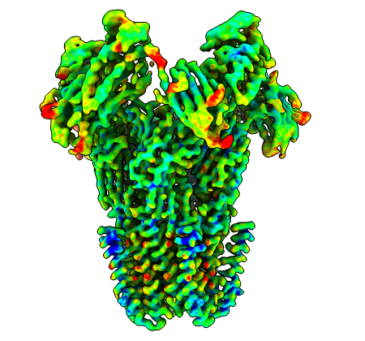
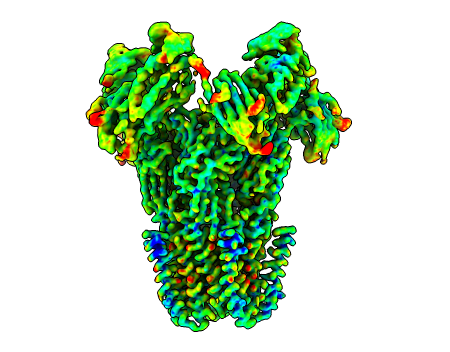

# LocScale-SURFER **S**egmentation of **U**nresolved **R**egions and **F**iltering for **E**nhanced **R**epresentation

LocScale-SURFER is a [ChimeraX](https://www.cgl.ucsf.edu/chimerax/) bundle for enhancing representation of transmembrane regions of membrane proteins. It is trained to segment voxels corresponding to the micelle belt of an unsharpened cryo-EM reconstruction. The segmented map can then be used to remove micelle densities from the target map. 

Note, there are two ways to speed up the computation. One is to provide a mask which restricts the prediction of detergent micelle to the region of interest. The other is to use a GPU for computation. By default, the tool uses a GPU if available. 

  

    

    

    <input type="range" class="c-compare__range" min="0" max="100" value="50"
           oninput="this.parentNode.style.setProperty('--value', this.value + '%')"
           style="position: absolute; bottom: 10px; left: 10px; width: 90%; z-index: 10;" />
  

