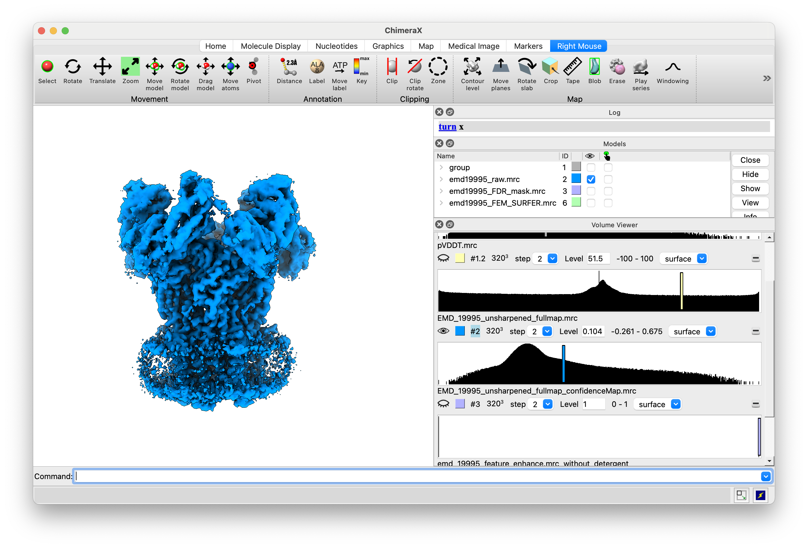
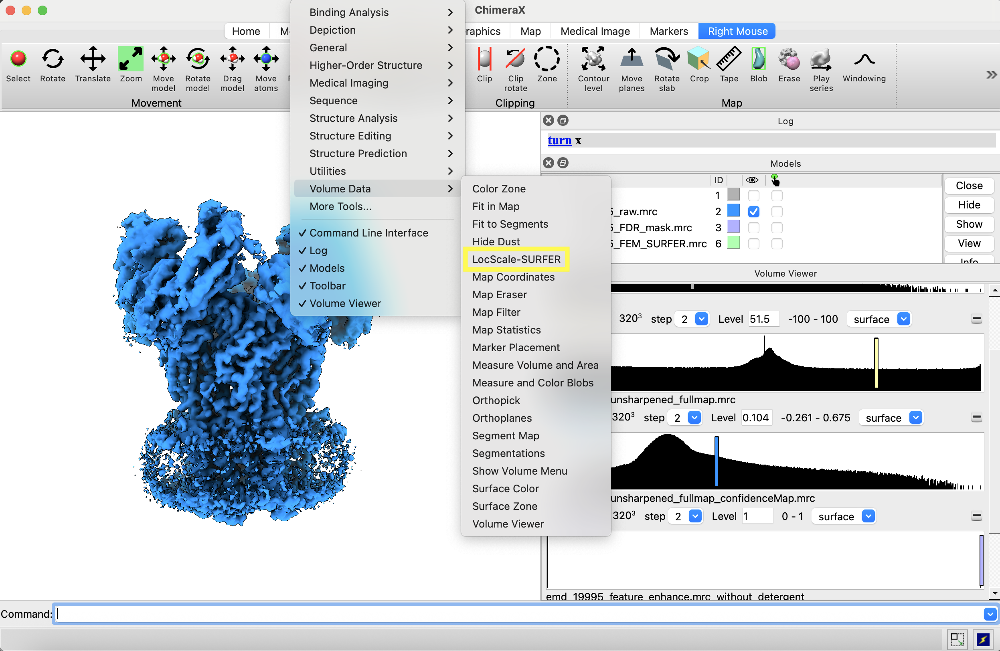
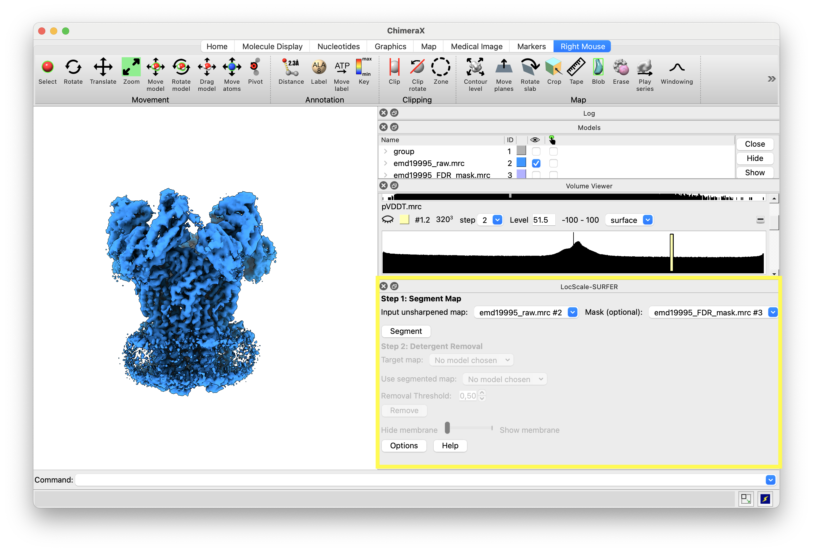
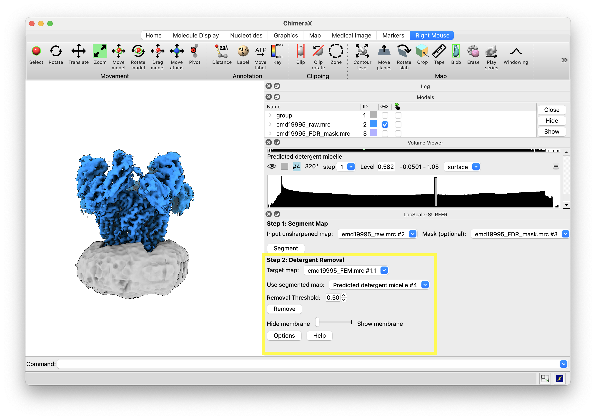
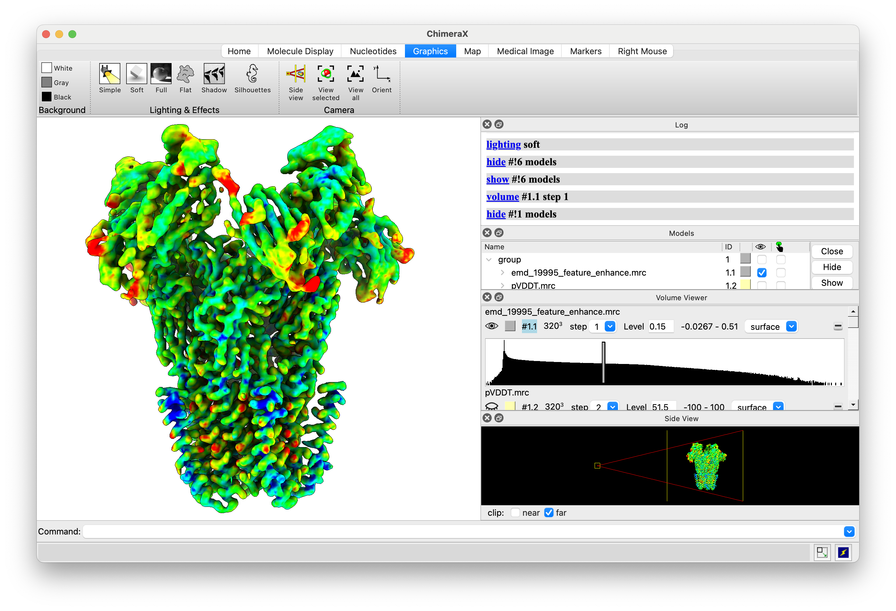
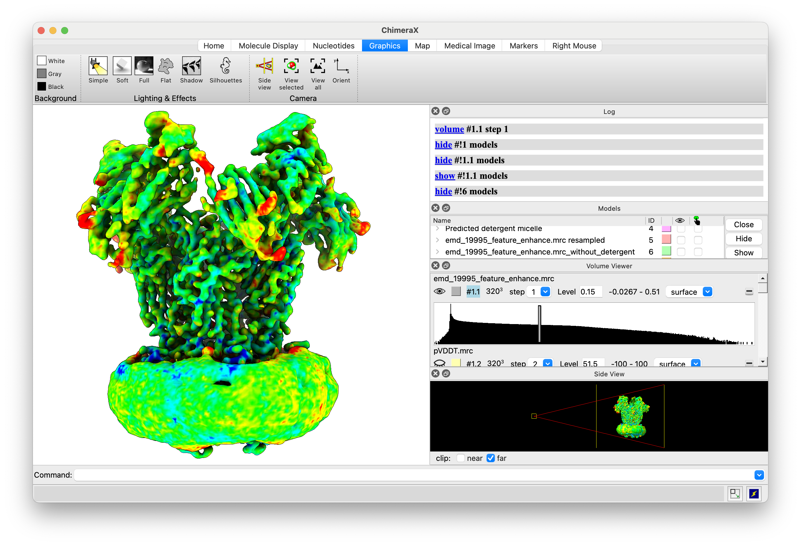

# LocScale-SURFER in ChimeraX

```LocScale-SURFER``` provides a GUI in ChimeraX from which all map operations can be performed.

### Step-by-step tutorial

In this example we will use the pentameric calcium-sensitive channel DeCLIC from _Desulfofustis glycolicus_ reconstituted in lipid nanodiscs [1](https://www.biorxiv.org/content/10.1101/2025.02.24.640012v1.full). You can download the maps here: [EMD-19995](https://www.ebi.ac.uk/emdb/EMD-19995?tab=interpretation)
<div class="grid cards" markdown>

-   :material-numeric-1-box:{ .lg .top } __Start ChimeraX session__  

    ---
    
    Start up [ChimeraX]() and load unsharpened map, LocScale-FEM (feature-enhanced) map and FDR confidence mask.

-   :material-numeric-2-box:{ .lg .top } __Launch LocScale-SURFER__  

    ---
    
    ```LocScale-SURFER``` is located under the _Volume Tools_ menu. This will launch the GUI.

-   :material-numeric-3-box:{ .lg .top } __Start micelle/membrane prediction__  
  
    ---
    
    In the LocScale-SURFER GUI select the raw, unsharpened map and the FDR confidence mask from the ```LocScale``` run. This will take 1-5 min, depending on the size of your map.


-   :material-numeric-4-box:{ .lg .top } __Segment and subtract micelle/membrane__  

    ---
    
    Select the map from which the segmented micelle should be subtracted (in this case the feature-enhanced map from ```LocScale-FEM```. This will create a new volume.

-   :material-numeric-5-box:{ .lg .top } __Toggle between maps with and without micelle__

    ---
    
    You can toggle between both maps with the toggle switch in the LocScale-SURFER GUI. Here contextual information is OFF.

-   :material-numeric-6-box:{ .lg .top } __Toggle between maps with and without micelle__

    ---
    
    You can toggle between both maps with the toggle switch in the LocScale-SURFER GUI. Here contextual information is ON.
